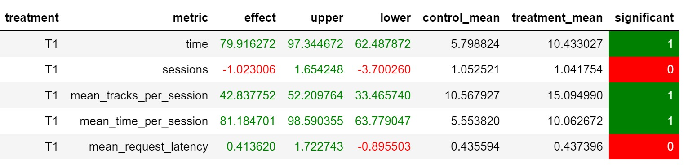

# Отчёт

### 1. Основная идея 
Для улучшения рекомендаций музыки было сделано следующее:

1) Переобучен нейросетевой рекомендер на тех же данных с добавлением эмбеддинга пользователя (nn_rec.ipynb). Полученный файл с рекомендациями: [рек-ии](../botify/data/my_tracks_with_recs_new.json)
2) Обучен рекомендер CF (knn_approach.ipynb). Полученный файл с рекомендациями использовался далее для `Indexed` рекомендера: [рек-ии](../botify/data/knn_v2.json)
3) Для треков, которые не были найдены пробовались `Random`, `TopPop` и `Indexed` рекомендеры
4) Рекомендации делались на основе последнего понравившевося трека - `last_fav_song`

### 2. Результаты
Наибольшее улучшение метрики `mean_time_per_session` удалось добиться, используя переобученный нейросетевой рекомендер и `Indexed` для ненайденных треков. Результаты представлены в ноутбуке `result.ipynb`.


# Инструкция запуска

Для запуска контейнера из директории `botify`:
1) Собираем образы и запускаем контейнеры
   ```
   docker-compose up -d --build 
   ```   
2) Проверяем, что сервис жив
   ```
   curl http://localhost:5000/
   ```
   
Для запуска симулятора из директории `sim`:
1) Создаем чистый env с python 3.7
2) Устанавливаем зависимости
   ```
   pip install -r requirements.txt
   ``` 
3) Добавляем текущую директорию в $PYTHONPATH
   ```
   export PYTHONPATH=${PYTHONPATH}:.
   ```
4) Запускаем симулятор
   ```
   python sim/run.py --episodes 1000 --config config/env.yml single --recommender remote --seed 31337 
   ```
